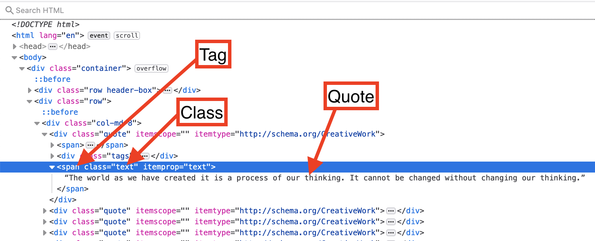
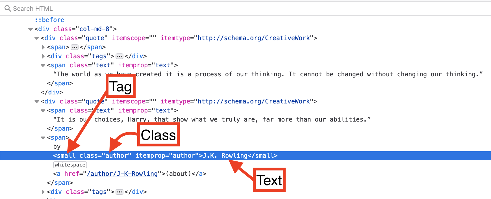

## Python for webscraping
Python is well suited for programatically scraping data from websites. There are three major packages used to webscraping in python.
**Beautifulsoup** is used for extracting and parsing (breaking down) webpage content <br> 
**selenium** is used to navigate webpages and input data into text fields <br>
**scrapy** is a framework for webscraping, look into it once you become comfortable with coding. We will not work with scrapy in the workshop, however, <a href='https://librarycarpentry.org/lc-webscraping/04-scrapy/index.html' target='_blank'>this </a> workshop offers a nice overview.

## Beautiful Soup

Beautiful soup is useful for scraping all content of a website, this includes the html content.

To get started we need to import requests, this package will return a http response from the page we are interested in scraping.
We will also import BeautifulSoup from the bs4 package, and import selenium.

```python
import requests
from bs4 import BeautifulSoup
import selenium

quotes_url = 'https://quotes.toscrape.com/' 
html_text = requests.get(quotes_url).text 
quotes_soup = BeautifulSoup(html_text, 'html.parser')

print(quotes_soup)
```

First we created a variable called quotes_url, this is the url or webpage that you want to scrape. 
Then we pass it to the requests function get, which gets a response from the webpage and returns all the html text back as a single chunk. You can see the output of this by running "print(html_text)" in your python console.
Now we can use beautiful soup to parse this into something that is readable, in this case html content. Run "print(quotes_soup)". This is now the same html as is visible when we use a browser to inspect the webpage. You can copy this text, save it as .html and then open it using your web browser. It will only contain the text, the links will not work. This is because we have only scraped the data from the main page, we have not scraped any of the data from the links. Also, it will not look pretty, again, this is because we have not collected the website code that dictates its style.

Now that we have scraped all the text from the main page of quotes to scrape, we should collect the specific information that we are after.

Collecting specific information can be easy if there are html tags for it. For example, we can extract quotes using their tag.

Lets inspect a quote using our browser. The following image shows that the quotes sit within the body, then under the span tag.


We can use the tag and class to access quotes. This will get the first quote.


```python
quote = quotes_soup.find_all('span', class_='text')

print(quote)
```
This has returned us a list with all the quotes on the first page. We still have some html code that we are probably not interested in. 
We can access the text of an individual quote using the .text command. We will subset our quote list to the first element and return the text.

```python
print(quote[0].text)
```
Lets remove the html for all the quotes. We will use a loop to go through the list. We will add the quote text to a new list called quotes.


```python
quotes = []
for i in range(0,len(quote)):
    quotes.append(quote[i].text)

print(quotes)
```
  
That looks good.

## Challenge
Use your web browser to inspect the authors and figure out how you can get their names.

<details style="border:3px; border-style:solid; border-color:#000000; padding: 1em;"><summary><h2>Solution</h2></summary>
<p>

Lets you our web browser to inspect author.



```python
author = quotes_soup.find_all('small', class_='author')

authors = []
for i in range(0,len(author)):
    authors.append(author[i].text)

```

</p>
</details>

## Selenium
Now the have the quotes and authors for the first page, but there are more pages. We need selenium so that we can select the next page button

Now we can use beautiful soup to extract the author names. This code will do it on the first page then stop. This is one scenario where selnium come to the rescue. We can use selenium to click on the next page button.


```python

import selenium

```

